# Pegelstand

**Webanalyse ohne Cookies, die auf jedem PHP-Webspace läuft.** Hochladen, installieren, fertig. Kein Docker, kein Node, kein Root, keine Kommandozeile.

Pegelstand zeigt dir, wie viele Menschen deine Websites besuchen, welche Seiten sie lesen und woher sie kommen. Die Besucher bleiben dabei anonym: Es gibt keine Cookies, keine Browser-Fingerabdrücke und keine gespeicherten IP-Adressen. Alle Daten bleiben auf deinem Server, es gehen keine Anfragen an Dritte.

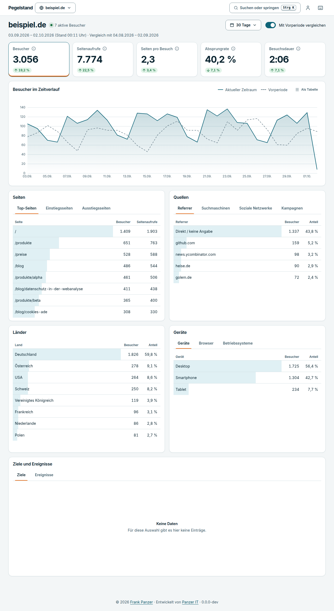

> **Status: in Entwicklung, noch nicht für den Produktivbetrieb gedacht.** Erfassung, Aggregation, Dashboard, Verwaltung und Zwei-Faktor-Anmeldung laufen. Ziele, E-Mail-Berichte, CSV-Export, REST-API, öffentliche Dashboards, Docker und das fertige Release-Zip fehlen noch (siehe [Fahrplan](#fahrplan)). Einen Download für Endnutzer gibt es erst mit Version 1.0.

## Inhalt

- [Was Pegelstand kann](#was-pegelstand-kann)
- [Datenschutz: Was gespeichert wird und was nicht](#datenschutz-was-gespeichert-wird-und-was-nicht)
- [Voraussetzungen](#voraussetzungen)
- [Installation](#installation)
- [Tracking-Code einbinden](#tracking-code-einbinden)
- [Das Dashboard](#das-dashboard)
- [Verwaltung](#verwaltung)
- [Konfiguration](#konfiguration)
- [Hintergrundjobs](#hintergrundjobs)
- [Leistung](#leistung)
- [Entwicklung](#entwicklung)
- [Fahrplan](#fahrplan)
- [Dokumentation](#dokumentation)
- [Lizenz](#lizenz)

## Was Pegelstand kann

- **Seitenaufrufe und Besucher** pro Website, mit Vergleich zur Vorperiode: Besucher, Seitenaufrufe, Seiten pro Besuch, Absprungrate, Besuchsdauer.
- **Zeitverlauf** als Diagramm (stündlich für Heute und Gestern, sonst täglich) und als Tabelle.
- **Auswertung nach** Seiten (Top, Einstieg, Ausstieg), Quellen (Referrer, Suchmaschinen, soziale Netzwerke, Kampagnen mit UTM), Ländern, Geräten, Browsern und Betriebssystemen.
- **Eigene Ereignisse** mit Eigenschaften (`pegelstand('Anmeldung', { props: { plan: 'pro' } })`), optional automatisch für ausgehende Links und Downloads.
- **Filter**: Ein Klick auf eine Zeile filtert das ganze Dashboard. Der Zustand steckt in der Adresse und lässt sich teilen.
- **Mehrere Websites** mit eigener Zeitzone und Aufbewahrungsfrist, **mehrere Benutzer** mit Rollen und Zwei-Faktor-Anmeldung.
- **Eigene Besuche ausschließen** per IP-Adresse oder Bereich.
- **Hell und dunkel**, bedienbar mit Tastatur und Smartphone (getestet bis 360 Pixel Breite), Prüfung mit axe-core gegen WCAG 2.2 AA.
- **Winziges Tracking-Script**: unter 2 KB (gzip).

| Dunkles Design | Auf dem Smartphone |
|---|---|
| 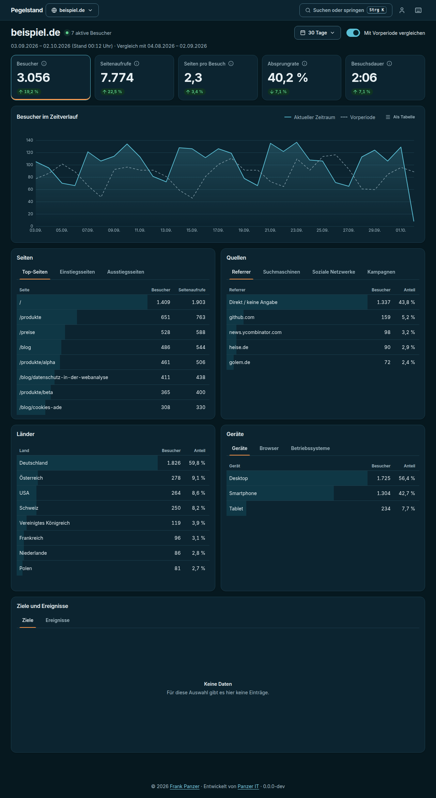 | 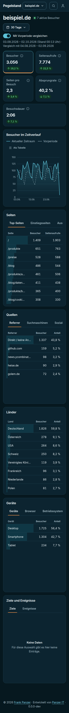 |

### Filtern mit einem Klick

Ein Klick auf „Deutschland“ und „Smartphone“ zeigt nur noch die Zahlen dieser Besucher. Die Filter erscheinen oben als Chips und lassen sich einzeln entfernen.

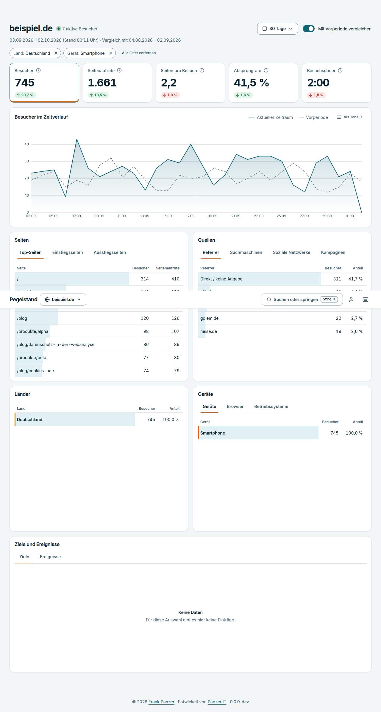

## Datenschutz: Was gespeichert wird und was nicht

Pegelstand ist so gebaut, dass möglichst wenig anfällt. Das ist eine technische Beschreibung, **keine Rechtsberatung**. Ob du für deine Website eine Einwilligung, einen Hinweis in der Datenschutzerklärung oder einen Auftragsverarbeitungsvertrag brauchst, klärst du selbst, gegebenenfalls mit einer Fachperson.

**Gespeichert wird pro Aufruf:**

- Zeitpunkt (UTC)
- Pfad der Seite **ohne** Query-String und ohne Anker (Ausnahme: UTM-Parameter)
- Referrer nur als Domain
- Land (nur mit hinterlegter GeoIP-Datei), Gerätetyp, Browser- und Betriebssystemname **ohne Versionsnummer**
- ein anonymer Besucher-Hash

**Nicht gespeichert und nicht protokolliert:** IP-Adressen, vollständiger User-Agent, Cookies, Bildschirmgröße, Sprache, Query-Strings.

**Der Besucher-Hash** entsteht aus Website, IP-Adresse und User-Agent mit einem zufälligen Tages-Salt (`HMAC-SHA-256`, auf 16 Byte gekürzt). Das Salt wechselt um Mitternacht (Standard: Europe/Berlin) und das alte Salt wird gelöscht. Danach lässt sich aus einem Hash keine Adresse mehr nachrechnen, und derselbe Mensch erscheint am nächsten Tag als neuer Besucher. Das hat eine Folge, die du kennen solltest: **Besucher über mehrere Tage sind die Summe der Tageswerte**, nicht die Zahl verschiedener Menschen.

Die IP-Adresse wird nur im Arbeitsspeicher für den Hash, die Ratenbegrenzung (über einen gesalzenen Hash) und die Länderbestimmung benutzt. IPv6-Adressen werden vorher auf das /64-Netz gekürzt.

Auf Wunsch beachtet Pegelstand `Do Not Track` und `Sec-GPC` (pro Website einstellbar, Standard: aus). Details stehen in [docs/tracking.md](docs/tracking.md).

## Voraussetzungen

- **PHP 8.2 oder neuer** mit den Erweiterungen `pdo_mysql`, `json`, `mbstring`, `openssl`, `session`
- **MySQL 8.0+** oder **MariaDB 10.6+**
- Apache mit `mod_rewrite` und `.htaccess`-Unterstützung (die mitgelieferte `.htaccess` sperrt interne Ordner). Eine Beispielkonfiguration für nginx folgt mit Version 1.0.
- Das Projektverzeichnis ist das Document Root, es gibt keinen `public/`-Ordner. Pegelstand läuft auch in einem Unterverzeichnis.

Getestet wurde bisher mit PHP 8.3 und MariaDB 10.11. Die übrigen Versionen prüft die CI-Matrix (PHP 8.2 bis 8.5, MySQL 8.0 und 8.4, MariaDB 10.6 und 11.4), die noch nie gelaufen ist. Behandle die Angaben deshalb als Ziel, nicht als Zusage.

## Installation

Das fertige Release-Zip (mit allen Abhängigkeiten und gebauten Dateien) erscheint mit Version 1.0. Bis dahin installierst du aus dem Quellcode, siehe [Entwicklung](#entwicklung). Der Ablauf für Endnutzer wird so aussehen:

1. Zip entpacken und den Inhalt auf deinen Webspace hochladen.
2. Eine leere Datenbank anlegen (in der Verwaltung deines Hosters).
3. Die Adresse im Browser öffnen. Der Installer führt dich in vier Schritten durch.

### 1. Systemprüfung

Der Installer prüft PHP-Version, Erweiterungen und Schreibrechte und erklärt bei jedem Hinweis, was zu tun ist. Er prüft im Browser auch, ob interne Ordner von außen erreichbar wären.

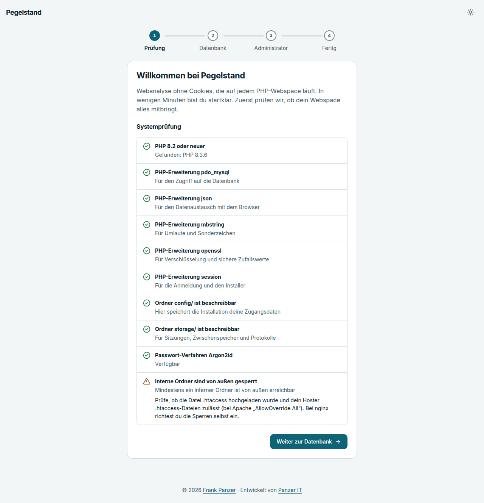

### 2. Datenbank

Zugangsdaten eintragen, Verbindung testen. Fehler werden verständlich erklärt, statt Rohmeldungen der Datenbank zu zeigen. Den Tabellenpräfix kannst du ändern, mehrere Installationen in einer Datenbank sind möglich.

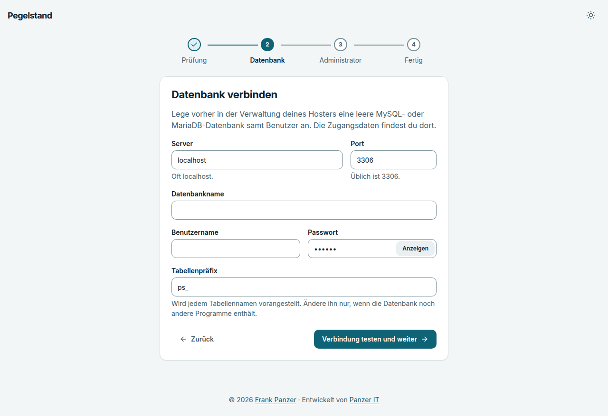

### 3. Administrator

Name, E-Mail-Adresse und ein Passwort mit mindestens 12 Zeichen. Danach sperrt sich der Installer selbst.

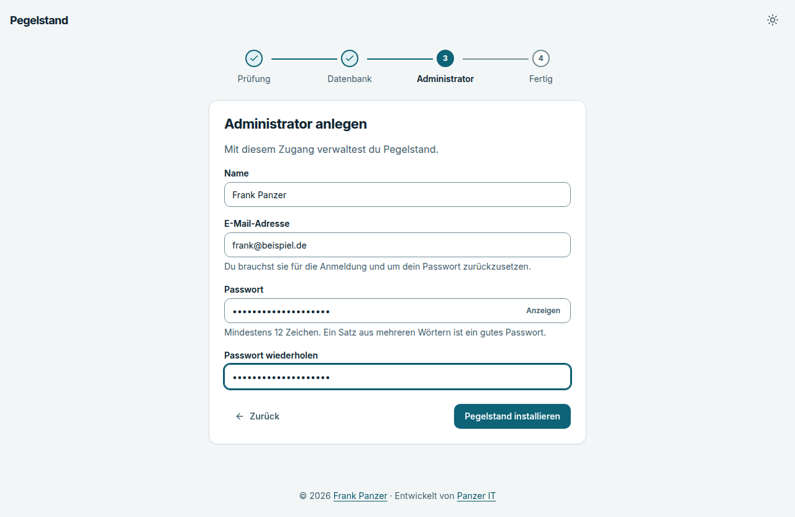

Updates brauchen keinen Handgriff: Neue Datenbankmigrationen laufen beim ersten Aufruf automatisch, währenddessen sehen Besucher eine Wartungsseite, die sich selbst neu lädt.

## Tracking-Code einbinden

Lege in den Einstellungen eine Website an und kopiere den fertigen Tracking-Code. Er sieht so aus:

```html
<script defer data-site="DEINE-SITE-ID" src="https://stats.beispiel.de/p.js"></script>
```

| Attribut | Wirkung |
|---|---|
| `data-api` | Endpunkt, falls er nicht neben dem Script liegt oder umbenannt wurde |
| `data-hash` | Wechsel des Anker-Teils (`#/seite`) als Seitenaufruf zählen |
| `data-outbound` | Ausgehende Links und Downloads als Ereignisse erfassen |
| `data-404` | Fehlerseiten als Ereignis `404` melden |
| `data-local` | Auch auf `localhost` erfassen (sonst bleibt das Script dort still) |

Einzelseiten-Anwendungen müssen nichts tun, das Script erkennt Navigation per `history.pushState`. Der Name des Scripts und des Endpunkts lässt sich ändern, damit Blocker-Listen sie nicht trivial treffen. Alles Weitere (eigene Ereignisse, Opt-out, Proxy-Betrieb, GeoIP) steht in [docs/tracking.md](docs/tracking.md).

Damit Länder angezeigt werden, legst du selbst eine GeoIP-Datenbank im MMDB-Format (z. B. DB-IP „IP to Country Lite“ oder MaxMind GeoLite2 Country) als `storage/geoip/country.mmdb` ab. Pegelstand lädt nichts selbst herunter. Beachte die Lizenz der Datei. Ohne sie bleibt das Land unbekannt, alles andere funktioniert.

## Das Dashboard

- **Kennzahlen** oben sind anklickbar und steuern das Diagramm.
- **Zeiträume** mit den Tasten `1` bis `7` (Heute, Gestern, 7 Tage, 30 Tage, Dieser Monat, Letzter Monat, Dieses Jahr) oder frei gewählt.
- **Befehlspalette** mit `Strg K`: zwischen Websites wechseln, Zeitraum und Diagramm umstellen, Darstellung wechseln.
- **`V`** schaltet den Vergleich um, **`F`** entfernt alle Filter, **`?`** zeigt alle Kürzel.
- Ohne Daten führt eine Einrichtungsseite mit dem fertigen Tracking-Code durch die ersten Schritte.

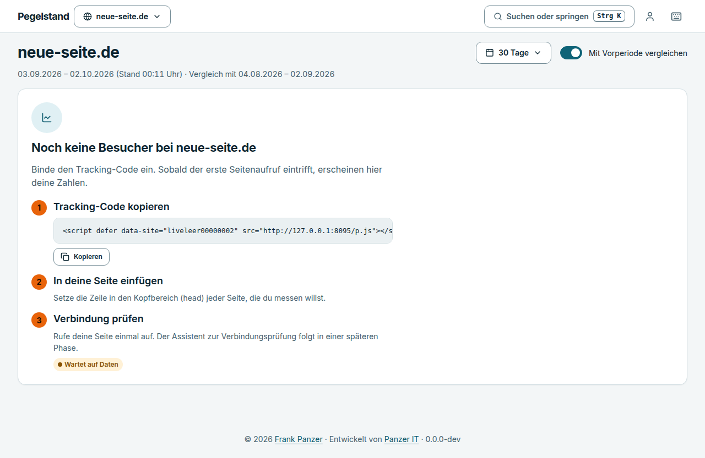

Die Zahlen ohne Filter stammen aus vorberechneten Tageswerten und erscheinen praktisch sofort. „Heute“, „Gestern“ und alle Filter lesen die einzelnen Aufrufe und stimmen in Echtzeit.

## Verwaltung

Unter **Einstellungen** (Konto-Menü oben rechts):

- **Websites** anlegen, ändern und löschen. Löschen entfernt alle Messdaten und verlangt zur Sicherheit die Eingabe der Domain. Pro Website: Zeitzone, Aufbewahrung der Rohdaten (Standard 730 Tage, Zusammenfassungen bleiben), weitere erlaubte Domains (auch `*.beispiel.de`), Do-Not-Track- und GPC-Schalter, Liste ausgeschlossener IP-Adressen.
- **Benutzer** mit den Rollen Administrator und Betrachter. Betrachter sehen nur Websites, die du freigibst. Der letzte aktive Administrator lässt sich nicht aussperren.
- **Mein Konto**: Passwort ändern und Zwei-Faktor-Anmeldung einrichten.

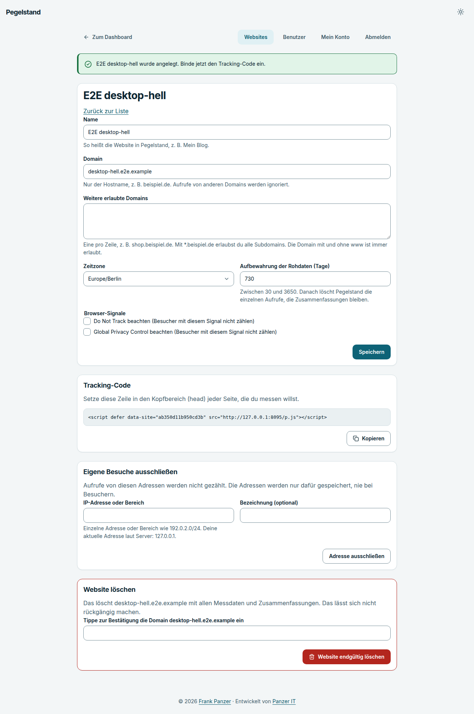

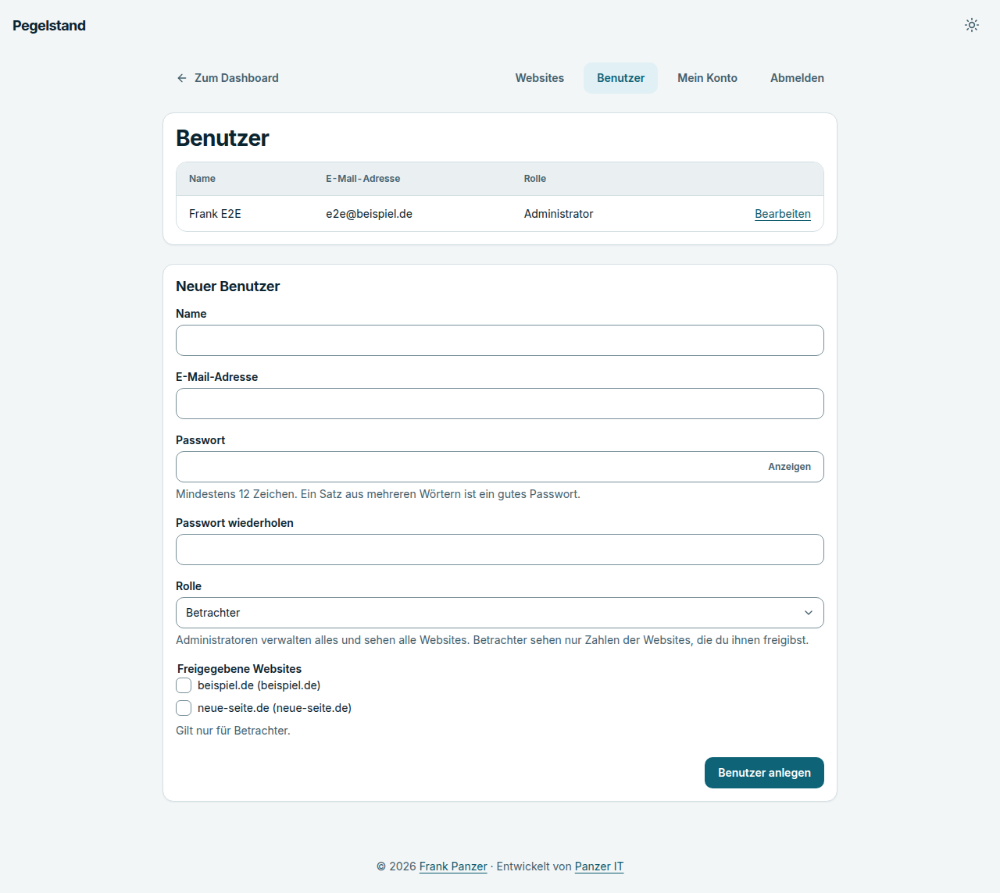

### Zwei-Faktor-Anmeldung

Zeitbasierte Einmalcodes nach RFC 6238, kompatibel mit gängigen Authenticator-Apps. Das Geheimnis liegt verschlüsselt (AES-256-GCM) in der Datenbank, jeder Code gilt nur einmal. Die Einrichtung läuft über den Schlüssel oder einen `otpauth://`-Link, einen QR-Code gibt es nicht. Verliert jemand sein Gerät, setzt ein Administrator die Zwei-Faktor-Anmeldung zurück.

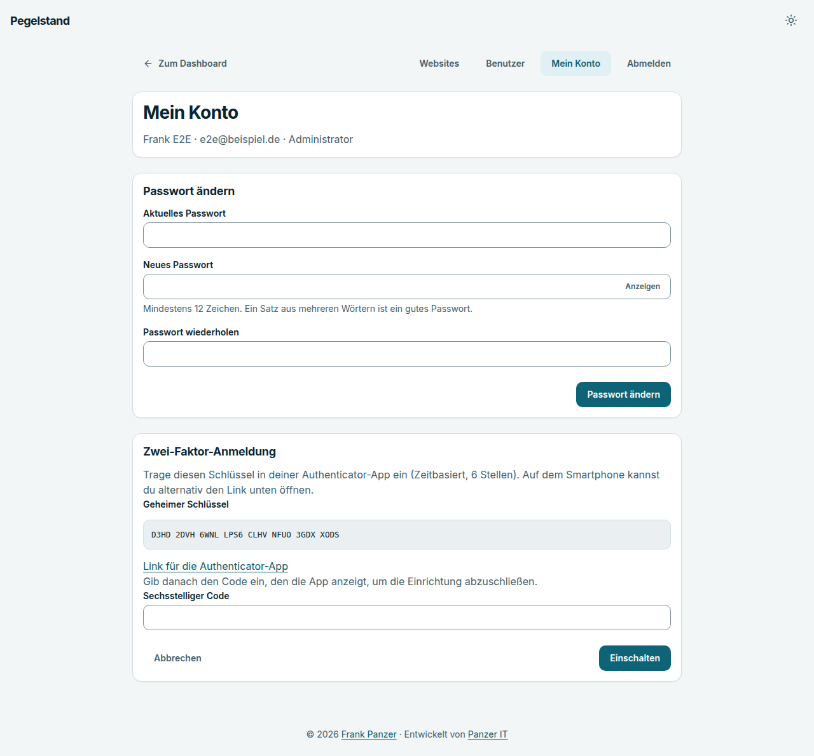

Anmeldeversuche sind begrenzt (Standard: 10 pro 15 Minuten und Adresse).

## Konfiguration

Der Installer erzeugt `config/config.php`. Zusätzlich möglich (Beispiele in `config/config.example.php`):

```php
return [
    // ... Datenbank und app_key, vom Installer gesetzt ...
    'timezone' => 'Europe/Berlin',
    'rotation_timezone' => 'Europe/Berlin',                      // Wechsel des Tages-Salts
    'tracker' => ['script_path' => '/stats.js', 'endpoint_path' => '/stats/senden'],
    'ingest' => ['rate_limit' => 300],                           // Anfragen pro Minute und Adresse
    'login' => ['rate_limit' => 10],                             // Anmeldeversuche pro 15 Minuten
    'cron' => ['mode' => 'external'],                            // siehe Hintergrundjobs
    'proxy' => ['header' => 'X-Forwarded-For', 'trusted' => ['127.0.0.1']],
];
```

Sichere die Konfigurationsdatei, sie enthält den `app_key`, ohne den sich Zwei-Faktor-Geheimnisse nicht entschlüsseln lassen.

## Hintergrundjobs

Zwei Jobs halten die Zahlen aktuell: die **Aggregation** (alle 5 Minuten) und das **Aufräumen** nach Ablauf der Aufbewahrungsfrist (stündlich).

- **Ohne Einrichtung** prüft Pegelstand nach Antworten an Besucher, ob ein Job fällig ist (höchstens einmal pro Minute).
- **Mit Cronjob**: `*/5 * * * * php /pfad/zu/pegelstand/bin/cron.php` und in der Konfiguration `'cron' => ['mode' => 'external']`.

Mehr dazu in [docs/hintergrundjobs.md](docs/hintergrundjobs.md).

## Leistung

Gemessen auf einer Entwicklungsmaschine mit MariaDB 10.11 und etwa 9 Millionen Ereignissen (Richtwerte, keine Zusagen):

| | Zeit |
|---|---|
| Aufruf erfassen (Median) | 2,4 ms |
| Kennzahlen aus Tagesaggregaten | 0,4 ms |
| Top-Seiten aus Aggregaten | 2,1 ms |
| Dieselben Kennzahlen aus Rohdaten | 14,7 s |

Speicherbedarf: rund 170 Byte pro Ereignis und 200 Byte pro Sitzung inklusive Indizes. Die Messung, ihre Grenzen und das Vorgehen stehen in [docs/performance.md](docs/performance.md). Mit `php bin/benchmark.php` misst du auf deinem Server selbst.

## Entwicklung

Voraussetzungen: PHP 8.2 oder neuer, Composer, Node.js (nur für Entwicklung und E2E-Tests), eine MySQL- oder MariaDB-Datenbank.

```bash
composer install
npm install
npm run build          # CSS, JavaScript, Schrift, Icons und Tracking-Script nach assets/

composer check         # Code-Style, PHPStan (Level max), PHPUnit
npm run test:e2e       # Playwright mit axe-core in vier Darstellungen
```

Zum Ausprobieren: Verzeichnis mit `php -S 127.0.0.1:8080` bedienen, im Browser öffnen und den Installer durchlaufen. Mit `php bin/demo-data.php --site=1 --days=90 --sessions=300` füllst du eine Website mit erfundenen Beispieldaten.

Integrationstests laufen gegen eine echte Datenbank, wenn `PEGELSTAND_TEST_DB_DSN`, `PEGELSTAND_TEST_DB_USER` und `PEGELSTAND_TEST_DB_PASSWORD` gesetzt sind, sonst werden sie übersprungen. Die E2E-Tests starten pro Darstellungsvariante (Desktop und Smartphone, hell und dunkel) einen eigenen PHP-Server.

Aufbau: kein Framework, sondern ein kleiner Kern (Front Controller, Router, Container, Templates in PHP) unter `src/`, Datenbankmigrationen unter `database/migrations/`, Oberfläche unter `resources/`. Alle Entscheidungen sind in [docs/entscheidungen.md](docs/entscheidungen.md) festgehalten, das Datenmodell in [docs/schema-entwurf.md](docs/schema-entwurf.md).

## Fahrplan

| Phase | Inhalt | Stand |
|---|---|---|
| 0 | Projektgerüst, CI | fertig |
| 1 | Designsystem, Dashboard-Prototyp | fertig |
| 2 | Datenbankschema, Migrationen, Installer | fertig |
| 3 | Erfassung: Tracking-Script, Endpunkt, Bot-Filter, Hashing | fertig |
| 4 | Sitzungen, Aggregation, Hintergrundjobs, Demo-Daten, Lasttest | fertig |
| 5 | Dashboard mit echten Daten | fertig |
| 6 | Verwaltung, Benutzer, Rollen, Zwei-Faktor | fertig, Passwort-Reset per E-Mail folgt mit Phase 7 |
| 7 | Ziele und Ereignisse, E-Mail-Berichte, CSV-Export, REST-API, öffentliche Dashboards | offen |
| 8 | Docker, Dokumentation, Demo-Modus, nginx-Beispiel, Release-Zip | offen |
| 9 | Projekt-Website | offen |

Erst nach Version 1.0 geplant: WordPress-Plugin, englische Oberfläche, Importe, Webhooks.

**Bekannte Schwächen:** Der laufende, noch unvollständige Tag erscheint im Diagramm als letzter Punkt und fällt dadurch ab. Gefilterte Ansichten über große Zeiträume lesen Rohdaten und sind langsamer. Zwei exakt gleichzeitige erste Aufrufe desselben Besuchers können zwei Sitzungen erzeugen. iPadOS meldet sich als Mac und zählt als Desktop.

## Dokumentation

| Datei | Inhalt |
|---|---|
| [docs/tracking.md](docs/tracking.md) | Einbindung, Ereignisse, Opt-out, Proxy, GeoIP, Datenschutz-Details |
| [docs/hintergrundjobs.md](docs/hintergrundjobs.md) | Aggregation, Cron, wie Zahlen entstehen |
| [docs/performance.md](docs/performance.md) | Messwerte und Grenzen |
| [docs/designsystem.md](docs/designsystem.md) | Farben, Typografie, Komponenten |
| [docs/glossar.md](docs/glossar.md) | Verbindliche Begriffe |
| [docs/schema-entwurf.md](docs/schema-entwurf.md) | Datenmodell |
| [docs/entscheidungen.md](docs/entscheidungen.md) | Entscheidungslog |
| [THIRD-PARTY.md](THIRD-PARTY.md) | Verwendete Fremdkomponenten (Inter, Lucide, uPlot) mit Lizenzen |

## Lizenz

[MIT](LICENSE). © 2026 [Frank Panzer](https://frank-panzer.de) · Entwickelt von [Panzer IT](https://panzerit.de)
